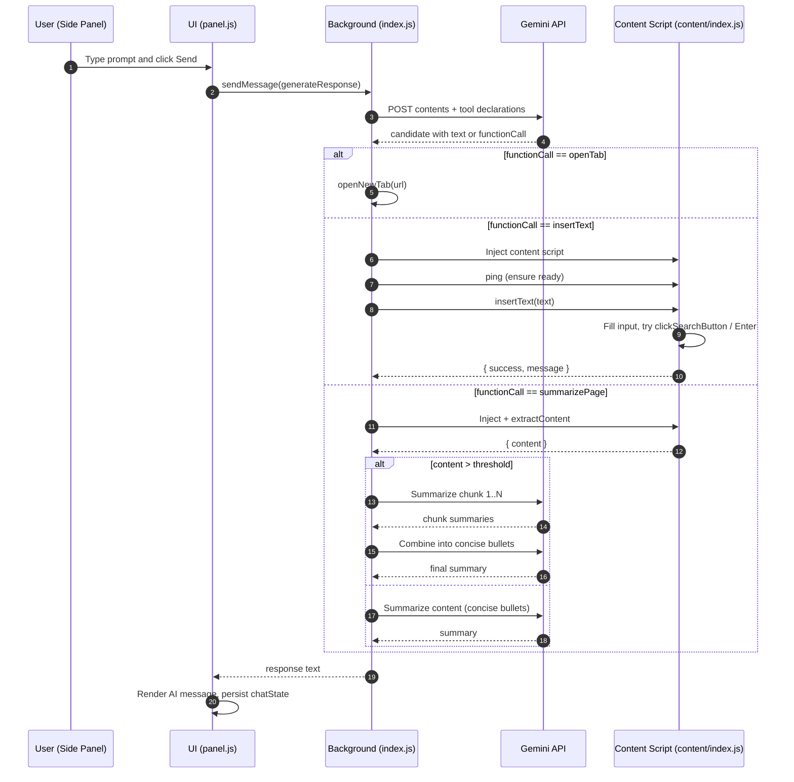
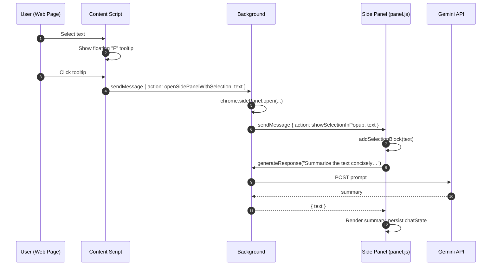
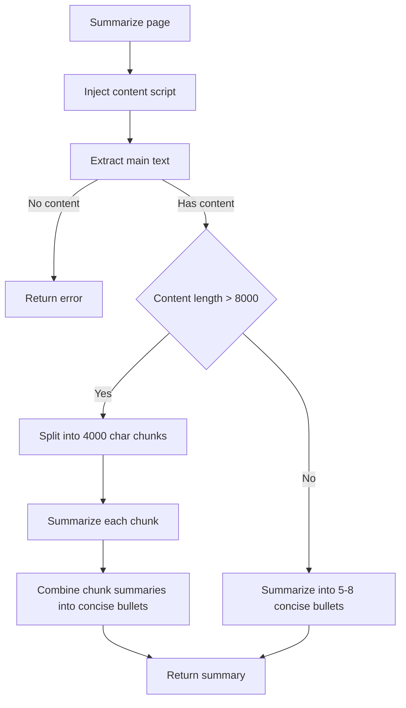
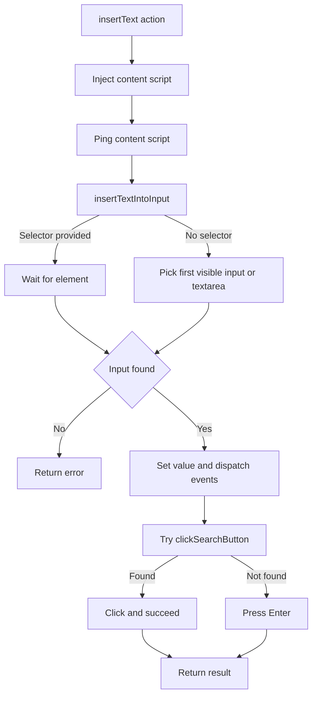

## Fustun AI Assistant – Code Information

This document explains the project structure, each file’s purpose, and the main functions with what they do.

### Project layout
- `manifest.json`: Chrome extension manifest and permissions.
- `index.html`: Placeholder noting side panel is under `src/ui/panel.html`.
- `futureEnhacements.txt`: Notes of planned features.
- `icons/`: Extension icon assets.
- `src/background/index.js`: Background service worker (ES module) – orchestrates AI calls and automation tools.
- `src/content/index.js`: Content script injected into web pages – DOM actions and selection tooltip.
- `src/ui/panel.html`: Side-panel UI markup and styles for the chat.
- `src/ui/panel.js`: Side-panel behavior: chat state, UI events, selection summarization.
- `src/services/config.js`: Gemini API configuration.
- `src/services/geminiClient.js`: Utility to call Gemini API and extract text responses.

---

### manifest.json
Defines the extension configuration.
- **Key fields**:
  - `permissions`: `activeTab`, `storage`, `tabs`, `scripting`, `sidePanel`.
  - `host_permissions`: `<all_urls>` (runs on all pages).
  - `side_panel.default_path`: `src/ui/panel.html`.
  - `background.service_worker`: `src/background/index.js`, `type: module`.
  - `content_scripts`: loads `src/content/index.js` on `<all_urls>`.

No functions here; it’s metadata that wires the app together.

---

### src/services/config.js
Holds Gemini API configuration.
- `GEMINI_API_KEY`: API key string.
- `GEMINI_API_URL`: Base URL for text generation endpoint.

---

### src/services/geminiClient.js
Helpers to call Gemini and read responses.
- `callGemini(contents, extra)`
  - Sends a POST to `GEMINI_API_URL` with `{ contents, ...extra }`.
  - Returns parsed JSON; throws on HTTP errors.
- `generateText(prompt)`
  - Convenience wrapper to call Gemini with a simple user prompt, returns extracted text.
- `extractText(data)`
  - Pulls the first textual part from a Gemini response object; returns empty string if absent.

---

### src/background/index.js
Background service worker – routes chat messages to Gemini and executes tool actions on tabs.

Functions:
- `openNewTab(url)`
  - Ensures protocol, opens a new tab, resolves with `{ success, tabId }`.
- `pingContentScript(tabId)`
  - Sends a `{ action: 'ping' }` to the content script; times out after 5s. Verifies the content script is responsive.
- `insertText(tabId, text, selector = null)`
  - Injects `src/content/index.js` (if needed), pings, sends `{ action: 'insertText' }` with optional `selector`. Returns the content script’s result.
- `getSystemInstruction()`
  - Returns the instruction text for the model describing available tools and how to use them.
- `handleUserMessage(message)`
  - Core loop calling Gemini with `functionDeclarations` for available tools.
  - Interprets `functionCall` responses and dispatches tool executions:
    - `openTab`: opens new tab via `openNewTab`.
    - `insertText`: types into page via content script and triggers likely submit/search.
    - `summarizePage`: injects content script, extracts visible content, summarizes (chunked if long) with concise prompts.
  - Accumulates conversation history and returns final text.

Event listeners:
- `chrome.runtime.onMessage`
  - `generateResponse`: calls `handleUserMessage` and returns the text.
  - `summarizeContent`: summarizes provided content in 2–3 concise sentences (no preamble).
  - `openSidePanelWithSelection`: opens side panel and forwards selected text to UI.
- `chrome.runtime.onInstalled`: sets side panel to open on action click.
- `chrome.runtime.onUpdateAvailable`: reloads extension when an update is available.

State:
- `lastExtractedSummary`: stores the latest summary string for potential context reuse.

---

### src/content/index.js
Content script – handles DOM interactions and selection tooltip on web pages.

Message handling:
- `onMessage` listener supports:
  - `insertText`
    - Calls `insertTextIntoInput(text, selector)` to place text in the first visible input/textarea (or by selector).
    - On success, calls `clickSearchButton()` to try clicking submit/search or press Enter.
  - `ping`
    - Responds with `{ success: true, message: 'pong' }`.
  - `extractContent`
    - Returns visible text from `main`, then `article`, else `document.body`.

Helpers:
- `isElementVisible(element)`
  - Checks CSS visibility/size to confirm the element is visible.
- `waitForElement(selector, timeout = 5000)`
  - Polls for an element by selector until it appears or timeout.
- `clickSearchButton()`
  - Tries a list of common search/submit selectors; if none found, simulates Enter on the focused input.
- `insertTextIntoInput(text, selector)`
  - Locates target input; sets value, dispatches `input` and `change` events.

Selection tooltip:
- `createSummarizeTooltip()`
  - Creates a floating circular "F" tooltip; attached to `document.body`.
- `showSummarizeTooltip(x, y)` / `hideSummarizeTooltip()`
  - Positions and toggles tooltip visibility within viewport bounds.
- Global listeners
  - `mouseup`: shows tooltip near the selection if non-empty.
  - `mousedown`: hides tooltip when clicking elsewhere.
  - `summarizeTooltip.onclick`: sends `{ action: 'openSidePanelWithSelection', text }` to background.

---

### src/ui/panel.html
Side-panel HTML and styles for the chat interface.
- Structure:
  - Header with title and refresh/close buttons.
  - `#response-area` for message bubbles.
  - `#status-bar` for loader/status.
  - Input area with text field and send button.
- Scripts:
  - Loads `./panel.js`.

No functions; this is the UI shell and styling.

---

### src/ui/panel.js
Side-panel logic – chat state, UI, and selection summarization.

State and elements:
- `chatState`: `{ messages: [] }` stored in `chrome.storage.local`.
- Element refs: `responseArea`, `textInput`, `sendButton`, `closeButton`, `refreshButton`, `statusBar`.

Loader/status helpers:
- `showStatusBar(message, showStop)`
- `startLoadingAnimation()` / `stopLoadingAnimation(finalMessage, showStop)`
- `handleStop()` / `hideStatusBar()`

UI actions:
- Close button: closes the side panel window.
- Refresh button: clears chat history from storage and UI.
- Send button click handler:
  - Pushes a user message, sends `{ action: 'generateResponse', message }` to background.
  - Appends AI response to chat and persists to storage.

Rendering:
- `updateResponseArea()`
  - Renders messages as bubbles; renders selection messages with a highlighted block.

Selection summarization:
- `addSelectionBlock(text)`
  - Adds a special "Selected Text" block to the chat.
- `summarizeSelection(text)`
  - Sends a concise no-preamble prompt to background; appends the returned summary.

---

### index.html
Placeholder file noting the side panel has moved to `src/ui/panel.html`.

---

### futureEnhacements.txt
List of planned features or ideas (macros, multi-page extraction, translation, chart API, writing assistant, autofill).

---

## Diagrams

### Sequence – Chat request with tool execution

### Sequence – Selection summarization via tooltip

### Flow – Page summarization (summarizePage)

### Flow – Insert text and trigger search (insertText)

